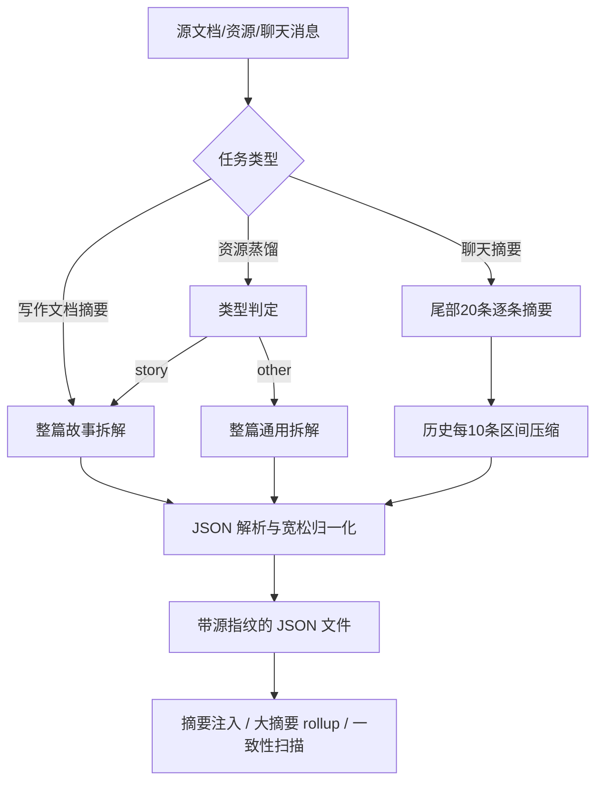

# VibeWrite 现有摘要／蒸馏生成机制现状报告

**报告日期：2026 年 8 月 17 日**  
**范围：** 项目内已实现代码、`PROJECT_CONTEXT.md`、三层记忆定稿文档与当前 Git 历史；不包含真实用户工作区的运行日志或任何联网 API 实测。  
**结论性质：** “已确认”均来自静态代码链路；“待验证”必须结合失败时的错误日志、模型配置与源文件样本确认。

---

## 1. 接手结论

项目工作区当前干净，最近一次提交为 `a4423a6`（更新交接文档）；`npm run typecheck` 已于 2026 年 8 月 17 日通过。摘要、资源蒸馏、聊天小摘要、大摘要（rollup）及注入/记忆规划均已有实现，主实现集中在 `src/main/services/summary.service.ts`。

目前问题的核心不是“没有机制”，而是**生成请求的容量控制、输出结构校验和失败可观测性没有形成闭环**。因此，部分文档或资源可能在同一配置下持续失败、或被错误地报告为成功；即使成功，也存在“结构不完整却被保存”的质量风险。

### 文档状态不一致（接手时必须注意）

- `docs/summary-distillation-refactor-plan-v2.md` 的开头仍写“未实施任何代码”，这与当前代码和 `PROJECT_CONTEXT.md` 不符；其中多数 P0/P1/P2/P3/P4/P6/P7 项已实现。
- 该定稿文档要求：长文档采用“分块提取→合并→rollup”、向量检索需要用户确认（C 门）。当前实现改为：**长文档仍整篇单次调用，只是限制输出条目数量；向量检索由记忆规划自动触发。**这两处是设计与实际行为的关键差异。

---

## 2. 现有机制总览

共同基础设施：

1. **配置与模型**：摘要复用对话主模型、主 API Base URL、同一个 `contextLimit`；默认值为 `gpt-4o` / `256000`。API Key 仅在主进程读取。
2. **请求串行化**：文档摘要、资源分类、资源蒸馏和 rollup 共用 `enqueueLlm`，全局并发为 1；聊天摘要另有独立的后台队列。
3. **文件存储**：产物使用原子写入，分别保存到项目目录的 `summaries/docs`、`summaries/resources`、`summaries/chats`、`summaries/rollups`。
4. **源指纹**：文档/资源摘要保存规范化正文的 SHA-256、原始长度、规范化长度与更新时间；用于惰性失效检测。
5. **LLM 输出处理**：尝试直接 JSON 解析；失败后去代码块、提取数组/对象，并对对象做一次“括号配平”抢救；随后进行字段默认化。

---

## 3. 各条生成链路

### 3.1 写作文档摘要（只按“故事”拆解）

**触发**

- 用户在摘要区点击“重新生成”；
- 文档级/上下文对话构建消息时，当前关联文档没有摘要或被判为过期，会阻塞调用 `ensureDocSummary`。

**生成步骤**

1. 读取全文；按模型名估算输入 token。
2. 以 `contextLimit × 60%` 作为输入上限；超限就直接报错，不做分块。
3. 全文作为 user message 发送，要求返回故事 JSON：`overview`、人物/别名/目标、情节链、伏笔、关键设定、关键台词。
4. 正常文本请求 `max_tokens=4096`；源文本字符数大于 20,000 时切换到“有界提示词”并请求 `max_tokens=8192`。
5. 若回复为空、JSON 解析后“总览+人物+情节”都为空、或 `finish_reason=length`，自动再试 1 次；仍失败则抛出“摘要生成不完整”。
6. 成功后附加源指纹并写入。

**新鲜度行为**

指纹改变不会立即意味着过期。只有“指纹不同”且“原始长度变化超过 30%”或“规范化长度差超过 100 字”时，才重建；小幅改写可能继续复用旧摘要。

### 3.2 资源蒸馏

**触发与交互**

用户先选择“故事”或“其他”类型。资源蒸馏不会自动发生。

**类型判定状态机**

1. 先做极保守启发式分类：叙事信号包括章节、引号、人物代词、对话；非叙事信号包括代码、标题、表格、链接、数字密度。
2. 混合/弱信号时，调用模型对开头、中部、结尾各约 2,000 字的样本分类，返回 `{type, confidence, reasons}`。
3. 置信度小于 0.8：要求用户确认；判定类型与用户所选类型不一致：要求用户重新选择；确认后 `force=true` 会跳过分类。
4. 最终仍将**完整资源正文**送入与文档摘要相同的故事拆解或通用拆解函数。

通用拆解返回：`docType`、概述、要点、术语、结构。资源摘要同样保存源指纹，资源内容明显改变后在读取概览时显示“待更新”。

### 3.3 聊天小摘要

- 关闭聊天窗口时经 IPC 投入后台队列；可在摘要区手动重新生成。
- 最近 20 条 user/assistant 消息会一起请求模型，要求逐条生成最多 30 字的摘要。
- 当总消息数超过 40，或整段聊天估算 token 超过输入预算的 60% 时，尾部窗口之前的消息每 10 条压缩成一个“进展/决策/待办”区间摘要。
- 每个 LLM 输入字符串均被直接截为前 12,000 个字符；然后按模型返回数组的下标回填到原消息。
- 失败的后台任务会把聊天 ID 记入 `<userData>/summary-retry.json`，下次启动尝试重试。

### 3.4 大摘要 rollup 与记忆使用

- 项目文档达到 50 篇后，每 10 篇文档摘要生成一条 rollup：总体走向、状态变化、因果/伏笔账本。
- rollup 输入是 10 个文档的小摘要，而非原文；如果任一成员摘要缺失则该块无法生成。
- 对话生成前会先注入小摘要；随后记忆规划模型可要求展开最多 5 条 rollup，且当前实现还可自动发起向量检索。它们属于“读取/注入”层，而非本报告关注的原文蒸馏生成层。

---

## 4. 已确认的结构性问题（按优先级）

### P0：输入预算与输出预算没有联动，极易超过真实上下文窗口

`callStoryDecomposition` / `callGenericDecomposition` 仅检查正文输入是否不超过 `max(4000, contextLimit × 0.6)`，随后无条件申请 2,048 / 4,096 / 8,192 个 completion tokens。它没有将系统提示词、JSON 输出上限、真实模型 completion limit 与“输入 + 输出 ≤ 模型上下文”一起计算。

这会导致：

- 小窗口模型尤其危险：配置为 4K 时，最低输入预算仍是 4K，再请求 4K 输出，尚未计入提示词就已经明显超窗；
- 长文档即使通过输入检查，仍可能在请求 8,192 输出时超过总窗口；
- 用户把界面中的 `contextLimit` 设置得高于实际模型能力时，本地检查会放行，最终由 API 以 4xx/超窗错误拒绝；
- 不同兼容 API 对 `max_tokens`、最大 completion tokens 的约束不同，目前没有能力探测或按模型适配。

这是“某些文档/资源始终失败”的首要已确认代码风险。

### P0：所谓“长文档有界摘要”仍是整篇单次调用，不具备超长文档的稳健性

大于 20,000 字符后，代码只是限制人物/情节点等**输出数量**，输入仍然是全文，且完成 token 反而提升到 8,192。它没有执行设计文档提出的“分块提取 → 去重合并 → rollup”。

因此有界提示词只缓解了“模型列出过多条目造成输出截断”，不能解决：输入本身超窗、模型的单次输出上限更低、特定段落遗漏、超长混合内容无法完整分类等问题。

### P1：资源蒸馏与聊天摘要失败的错误日志不完整，和交接文档描述不一致

代码中 `logError('summary:doc', ...)` 只用于自动 `ensureDocSummary` 的文档首次生成/更新失败。

- `distillResource` 自行捕获异常，返回 `{ok:false,error}`，未写 `[summary:res]` 日志；由于异常不再向 IPC 冒泡，通用 IPC 错误日志也不会补上。
- 聊天摘要后台队列会吞掉异常，只记录重试 ID；未写错误日志。
- 手动文档重生失败会返回 UI，但也没有调用 `logError`。

因此目前“查看 `[summary:doc]` / `[summary:res]` 日志定位所有失败”的交接说明不能完全成立。对“持续失败”的资源来说，缺少原始 API 错误、模型名、正文规模、尝试次数等关键证据。

### P1：手动重新生成聊天摘要可能在实际失败时仍提示成功

`regenerateChatSummary` 等待 `queueChatSummary(chatId, true)` 后直接返回 `{ok:true}`；但 `queueChatSummary` 已在内部捕获 `generateChatSummary` 的失败并正常 resolve。因此 UI 可能显示“聊天摘要已重新生成”，实际却没有写出新的摘要，只留下后台重试标记。这是可由当前控制流直接确认的错误反馈缺陷。

### P1：JSON 解析“宽松”，但 schema 校验“很弱”

当前逻辑能够尽量把模型回复解析出来，却没有验证关键字段是否满足提示词约束：

- 未校验故事 `plot.function` 是否属于允许枚举；
- 未校验人物/情节对象是否有有效名称和正文；
- 未校验数组长度、单项长度、语言、重复项或语义覆盖；
- 普通化后只要 `overview` 非空，或人物/情节数组非空，就可保存。

这降低了“格式不规范就完全失败”的概率，却提高了“半截 JSON、字段错位、空对象、模型随意输出被当成成功摘要”的概率。对话逐条摘要更明显：模型少返回几项时，缺失项会静默写成空字符串。

### P2：聊天摘要会静默截断输入并依赖位置对应

最近 20 条消息拼接后被 `.slice(0, 12000)` 截断；如果早期某条很长，后续消息根本未参与摘要。模型输出数组还被按下标回填，而不是依照 `messageId` 校验。因此模型少项、重排、输出额外项时，系统不会报错，只会产生错位或空摘要。历史区间摘要同样有 12,000 字符硬截断。

### P2：rollup 缺少独立的上下文/输出预算与可观测性

每个 rollup 将 10 个完整“小摘要块”拼接后直接请求 2,048 completion tokens，没有预估输入总量、没有长度分档，也没有专门的错误日志。随着小摘要变长或模型窗口变小，rollup 会成为另一类难以定位的失败点。

### P2：源指纹策略是“显著变化检测”，不是严格新鲜度保证

同长度改写、或规范化字符差不超过 100 的重要修改不会使文档摘要过期。资源能显示黄标；文档概览目前没有相同的 stale 字段显示。这是产品体验上的既定取舍，但它会导致摘要与原文语义不同步，并会向 rollup/注入层传递旧信息。

---

## 5. 仍待用真实失败样本验证的假设

1. 用户设置的 `contextLimit` 高于所使用模型/网关的实际窗口，或模型的最大 completion token 更小；这是交接文档已提出、且与 P0 完全一致的高概率假设。
2. 兼容 API 对 `max_tokens`、JSON 输出、`finish_reason` 的行为与 OpenAI SDK 默认假设不一致。
3. 模型会返回 Markdown、解释文字、空 JSON、截断 JSON 或不符合 schema 的 JSON；当前代码有“抢救式解析”，但没有记录原始回复，因此无法区分“请求失败”和“质量不合格”。
4. 个别资源是混合文档或超长文档，分类采样虽能决定类型，但后续整篇提取仍无法在单次请求中完成。
5. 全局 LLM 串行队列会让摘要、分类、rollup 互相排队。它本身通常造成慢/超时而非逻辑失败，但在多个 180 秒请求堆积时会明显放大用户“始终没有结果”的感受。

---

## 6. 现有机制的优点（应保留）

- 源指纹、原子写入、状态广播、用量记录、摘要注入透明卡的基础已具备；
- 分类采用“保守启发式 → 三段采样 LLM → 低置信度用户确认”，避免了盲目自动蒸馏；
- 文档/资源统一使用结构化摘要模型，利于后续检索和一致性规则；
- 全局串行队列避免摘要请求并发挤爆兼容 API；
- 聊天摘要有增量维护和重试持久化，不需要每次全量重算；
- 长文本输出限制、空结果/`finish_reason=length` 二次尝试，已经是正确方向，但需要进入完整的容量与校验闭环。

---

## 7. 下一轮讨论前建议收集的最小事实

在不改动方案前，建议先拿到至少一条“始终失败”的文档和一条资源蒸馏失败样本（可脱敏），以及以下信息：

1. 发生时间、操作入口（自动文档摘要/手动文档摘要/资源蒸馏/聊天摘要/rollup）；
2. API Base URL、模型名、用户设置的 `contextLimit`（API Key 不要提供）；
3. 原文字符数、主要语言、是否混合格式；
4. UI 显示的完整错误文字；
5. 对应日期的 `<userData>/logs/errors-YYYY-MM-DD.log` 中相关行；
6. 失败后是否出现摘要文件、内容是否为空/旧版本、是否有“生成成功”却内容未变化的情况。

这些证据将决定后续优先解决的是：**请求容量控制**、**超长文本分级/分块提取**、**结构化输出与严格校验**、还是**观测与重试状态机**。当前最不建议的做法是继续只增加提示词限制或盲目提高 `max_tokens`；它们无法修复 P0 的请求预算矛盾。

---

## 8. 关键代码定位

| 主题 | 位置 |
| --- | --- |
| 摘要/蒸馏主逻辑 | `D:\\ds h-project\\src\\main\\services\\summary.service.ts` |
| 对话消息注入、记忆规划 | `D:\\ds h-project\\src\\main\\services\\api.service.ts` |
| 源指纹与失效判定 | `D:\\ds h-project\\src\\main\\summary-source.ts` |
| 摘要文件读写/旧格式读取 | `D:\\ds h-project\\src\\main\\services\\file.service.ts` |
| 资源蒸馏 UI 状态机 | `D:\\ds h-project\\src\\renderer\\src\\lib\\summaryActions.ts` |
| 摘要区与手动重新生成 UI | `D:\\ds h-project\\src\\renderer\\src\\components\\layout\\SummaryArea.tsx` |
| 三层记忆设计基线（存在实现状态滞后） | `D:\\ds h-project\\docs\\summary-distillation-refactor-plan-v2.md` |
| 项目交接总览 | `D:\\ds h-project\\PROJECT_CONTEXT.md` |

