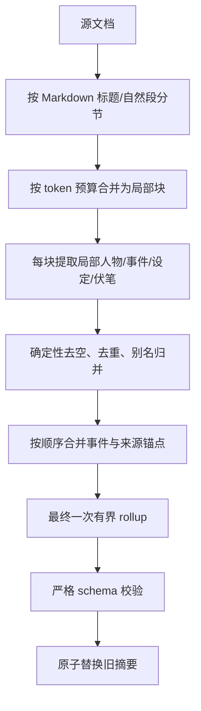

# VibeWrite 摘要／蒸馏失败根因与解决方案报告

**日期：2026 年 8 月 17 日**
**结论状态：故障分支与通用架构根因已确定；DeepSeek thinking 是本次样本的高置信触发因素之一，但不是解决方案的适配边界。软件允许用户自由接入 OpenAI-compatible 模型，因此修复必须采用“能力协商 + 供应商适配 + 有界结构化生成”的模型无关架构。尚未修改生成实现，等待方案讨论确认。**
**证据范围：** 当前代码、`PROJECT_CONTEXT.md`、本地模型与依赖、用户实际配置、2026-08-17 用量聚合、错误日志目录、两份失败样本，以及 OpenAI、DeepSeek、Ollama、LM Studio、vLLM 的官方兼容/结构化输出文档。

---

## 1. 执行摘要

这次问题不是“文档超过 DeepSeek V4 的 100 万 token 上下文”。可以确定的通用架构根因是：**应用把“OpenAI-compatible”误当成统一能力标准，只保存 `baseURL + model + contextLimit`，然后向所有模型发送同一套结构化生成参数；与此同时又把上下文窗口与单次输出预算混为一谈，输出协议可膨胀，失败后仍以相同条件重试。**

“OpenAI-compatible”只能说明接口形状大致相似，不能保证以下能力一致：

- 是否支持 `json_schema`、`json_object`，还是只能靠提示词输出 JSON；
- 是否存在 thinking/reasoning，以及如何关闭或降低；
- 使用 `max_tokens` 还是其他输出预算字段；
- `temperature` 对当前模型是否有效、被忽略或被拒绝；
- 是否返回 `reasoning_content`、reasoning token、标准 `finish_reason` 与完整 usage；
- 推理服务支持结构化约束，不等于所加载的小模型具备足够的语义提取能力。

当前 DeepSeek V4 配置揭示了这个通用缺陷：应用没有识别其默认 thinking 行为，固定的 `4096/8192` completion 预算需要同时容纳思考与最终 JSON，且结构化摘要本身没有稳定体量边界。预算耗尽时会出现 `finish_reason="length"`、半截 JSON 或空可见内容；随后同参数重试，因而稳定失败或概率失败。

两份样本与这个因果链一致：

- **“硝烟粉笔灰”**只有 3215 个字符，输入远未超窗，但不会进入长文档有界模式，只获得 4096 completion tokens；提示词还要求“覆盖全文、不遗漏重要情节”，人物、情节、伏笔、设定、关键台词均无数量上限。DeepSeek 默认思考是当前配置下的触发因素，而“无能力适配 + 无界输出 + 固定预算”才是会在其他模型上以不同形式复现的架构问题。
- **“龙常剧情书（原文）”**约 11 万字，会获得 8192 completion tokens，并启用部分数组上限；有时结果能在预算内闭合，有时不能，所以出现概率性成功。即使换成没有 thinking 的模型，单次全文生成大型 JSON 仍然不稳定。

此外还有三类独立缺陷，解释用户以前看到的“失败后仍有摘要文件”“显示成功但内容为空”：

1. **失败后旧摘要仍保留**：新摘要只有成功后才原子替换，UI 未说明“正在继续使用旧摘要”，容易误认为失败操作生成了文件。
2. **结构校验过弱**：`characters:[{}]`、`plot:[{}]`、`keyPoints:[""]` 等语义空结果会因数组长度大于 0 而被当成成功并保存。
3. **聊天手动重生成存在假成功**：后台队列吞掉异常后 resolve，外层仍返回 `{ok:true}`。

推荐的 P0 不应是“给 DeepSeek 加一个字段”，而应是：**建立统一的结构化任务执行器和模型能力档案；由适配层按能力选择 JSON Schema、JSON mode 或 prompt-only，按供应商能力控制 reasoning；所有模型共用有界 schema、严格校验、错误分类、自适应降级和逐次日志。** DeepSeek 的 `thinking: disabled` 只是该适配层中的一个已知配置，不应散落在摘要业务代码里。

## 2. 证据与排除过程

### 2.1 用户实际配置

`C:\Users\l\AppData\Roaming\writing-agent\app-config.json` 当前为：

```json
{
  "model": "deepseek-v4-flash",
  "apiBaseUrl": "https://api.deepseek.com",
  "contextLimit": 1000000,
  "summaryEnabled": true,
  "workspaceDir": "C:\\Users\\l\\Desktop\\test"
}
```

代码输入门槛是 `contextLimit × 60%`，即约 600,000 token。两份样本均远低于此值，所以本次不是应用输入门槛拒绝。

### 2.2 样本规模

| 样本 | 字符数 | 当前估算 token | 现有代码档位 | 请求 `max_tokens` | 结果 |
| --- | ---: | ---: | --- | ---: | --- |
| 硝烟粉笔灰 | 3,215 | 约 3,537 | 普通故事摘要 | 4,096 | 稳定失败 |
| 龙常剧情书（片段） | 11,517 | 约 12,669 | 普通故事摘要 | 4,096 | 片段仅用于分析 |
| 龙常剧情书（原文） | 约 11 万字 | 约 12 万 token 量级 | 长文档有界摘要 | 8,192 | 本次成功，历史高频失败 |

“硝烟粉笔灰”体积很小却稳定失败，直接否定了“必须输入超窗才会失败”的解释。

### 2.3 错误文案的唯一代码来源

`src/main/services/summary.service.ts` 中，该错误只会在两次尝试均出现以下任一情况后抛出：

1. `finish_reason === "length"`；
2. 模型可见回复无法解析成非空摘要。

因此，UI 文案“摘要生成不完整（内容为空或被截断），请重试”已经把直接失败点缩小到**生成结果截断/空内容/解析空结果**，不是文件读取、工作区路径或保存权限。

### 2.4 用量数据说明 API 确实返回过 completion

2026-08-17 的 18 点小时桶记录：

```json
{
  "prompt": 144222,
  "completion": 20856,
  "total": 165078,
  "calls": 5,
  "summary": 165078
}
```

`recordUsage` 只在 SDK 已拿到 completion 响应且响应含 `usage` 时调用。因此，这组操作不是单纯网络失败或 API 直接拒绝。聚合数据不能还原每一次调用，但 20,856 个 completion tokens 与“多个调用接近 4096/8192 上限”高度一致。

当前用量结构只保存 `prompt_tokens/completion_tokens/total_tokens`，丢弃了 DeepSeek 返回的 `completion_tokens_details.reasoning_tokens`，所以无法从现有文件区分“隐藏思考用了多少”和“最终 JSON 用了多少”。

**证据边界：** 历史手动生成没有逐次日志，因此不能从现存文件直接证明某一次失败具体消耗了多少 reasoning token；这里对 thinking 的主因判定来自官方协议、当前请求参数、错误分支、样本规模差异和聚合用量的交叉印证。实施 P0 后应以同一短样本做 `provider-default` 与 `thinking disabled` A/B 回归，完成最终量化确认。

### 2.5 日志缺失不是“没有失败”，而是实现没有记录

日志目录只有 `errors-2026-08-15.log`，没有 2026-08-17 的摘要失败记录。代码核对结果：

- 自动 `ensureDocSummary` 失败会写 `[summary:doc]`；
- 手动文档重新生成捕获异常后直接返回 UI，不写日志；
- 资源蒸馏捕获异常后直接返回 `{ok:false}`，不写日志；
- 聊天摘要队列吞异常，仅写重试 ID。

因此，交接文档里“所有摘要/蒸馏失败都会自动落日志”的说法不准确。

---

## 3. 根因判定

### 3.1 根因 A：缺少模型能力协商与请求适配层（确定的架构根因；DeepSeek thinking 是当前触发因素）

当前配置和服务层只知道：

```text
baseURL / apiKey / model / contextLimit / language
```

但结构化任务实际还需要知道：

```text
结构化输出级别
reasoning/thinking 控制方式
输出 token 参数与上限
temperature 等采样参数是否可用
usage / reasoning / finish reason 的返回形态
模型是否有能力完成当前 schema
```

当前所有摘要调用把同一套 `temperature + max_tokens + prompt JSON` 直接发给任意 OpenAI-compatible endpoint。这意味着：

- 对 DeepSeek V4，未关闭默认 thinking；
- 对只支持 JSON mode、不支持 JSON Schema 的服务，不能使用最强约束；
- 对支持 JSON Schema 的 OpenAI、LM Studio 等服务，当前又没有利用其能力；
- 对 vLLM 等具有额外结构化参数的服务，没有适配入口；
- 对小型本地模型，即使服务端支持 grammar/schema，也不能假设模型能正确抽取复杂剧情语义；
- 对未知网关，发送私有字段可能被 400 拒绝，完全不发送可用能力又会降低稳定性。

因此，“识别 DeepSeek 并关闭 thinking”只能修复当前样本，不能满足产品的自由接入定位。正确边界应是：**摘要业务描述任务语义和目标 schema；统一执行器选择能力策略；供应商适配器负责把策略翻译成具体请求字段；本地 validator 决定是否真正成功。**

在当前 DeepSeek 配置下，官方文档确认 thinking 默认开启，且其 OpenAI 格式通过 `thinking`/`reasoning_effort` 控制，思考模式下部分采样参数无效。这是本次短文档稳定失败的高置信触发因素，但应被建模为 capability profile，而不是写成全局特例。

### 3.2 根因 B：输出协议鼓励膨胀，普通文档完全没有数量上限（高置信，共同主因）

普通故事提示词同时要求：

- 覆盖全文；
- 不遗漏重要情节；
- 输出人物、情节、伏笔、关键设定、关键台词；
- 情节点“尽量具体”；
- 只有单字段字数限制，没有数组数量限制。

这会让模型把“摘要”理解成尽可能完整的结构化复述。“硝烟粉笔灰”虽然短，却包含医疗日志、课堂框架、多个国家/组织隐喻、大段解释性对话、空袭和结尾反转，模型很容易把每轮解释和每个隐喻都拆成独立情节点、设定和台词。

长文档虽然有数组上限，但当前上限总和仍可达到 170 项：20 人物 + 40 情节 + 30 伏笔 + 40 设定 + 40 台词；加上多字段 JSON，8192 tokens 仍可能不足。

### 3.3 根因 C：重试没有改变失败条件（确定）

第一次失败后，第二次仍使用相同：

- 全文输入；
- prompt；
- 思考模式；
- `max_tokens`；
- schema；
- temperature。

这不是自适应恢复，只是重复请求。稳定超预算的样本会再次超预算；临界样本则表现为概率成功。

### 3.4 根因 D：没有严格 schema/语义完整性校验（确定）

当前 `normalizeStory`/`normalizeGeneric` 只做类型宽容转换：

- 未校验枚举；
- 未限制数组数量；
- 未限制实际字符串长度；
- 未删除空对象/空字符串；
- 未检查故事情节是否有非空 summary；
- 未检查资源要点是否为非空文本。

当前空判断只检查：

```ts
!overview && characters.length === 0 && plot.length === 0
```

所以 `characters:[{}]` 或 `plot:[{}]` 就能绕过空判断。它直接解释“显示成功但内容为空/近似为空”。

### 3.5 根因 E：错误状态和旧摘要状态没有分离（确定）

文档与资源摘要在新结果通过现有检查后才写入，且底层是原子写。这一点本身正确。但失败时：

- 旧摘要文件继续存在；
- UI 只显示本次失败，不显示“旧摘要仍在使用”；
- 没有独立的 `lastGenerationAttempt` 状态。

因此，用户可能把旧文件误认为失败调用新生成的文件。

聊天摘要还有更直接的问题：`queueChatSummary` 捕获错误后不重新抛出，`regenerateChatSummary` 随后固定返回成功，属于真正的“假成功”。

---

## 4. 两份样本为何表现不同

### 4.1 “硝烟粉笔灰”稳定失败

因果链：


这比“模型上下文太小”更符合所有证据。

### 4.2 “龙常剧情书（原文）”概率成功

原文会进入 `large`：

- `max_tokens` 从 4096 提高到 8192；
- prompt 增加数量上限；
- 但思考模式仍开启；
- 输出上限仍很大，且要求覆盖整篇 11 万字剧情。

每次模型在“思考量、保留多少角色/事件、每项写多细”上的实际消耗会不同。只要思考与 JSON 总量低于 8192，就成功；否则失败。于是形成“高频失败但偶尔成功”。

### 4.3 为什么不能只关闭 DeepSeek thinking 或只调大 `max_tokens`

只关闭 DeepSeek thinking 可以显著降低当前样本的失败概率，但不能解决自由接入模型后的其他差异：

1. 有的服务支持严格 JSON Schema，有的只支持 JSON mode，有的只接受普通文本；
2. 不同 reasoning 模型的开关字段和可选档位不同，未知服务可能拒绝私有字段；
3. 本地小模型即使输出 JSON 合法，也可能在语义上漏项、错位或返回空壳；
4. 无限扩大输出会让“小摘要”失去可注入性，并增加成本、等待和失败浪费；
5. 超长文档单次全文提取仍是信息瓶颈，与是否 thinking 无关。

合理顺序应当是：**先建立能力适配与可观测性 → 所有模型使用有界输出和严格校验 → 按错误类型自适应降级 → 长文档分级提取。** DeepSeek thinking 关闭应作为第一个已知适配规则进入该框架。

## 5. 推荐解决方案

### 5.1 P0：建立模型无关的结构化生成兼容层

#### P0-1. 把摘要业务与供应商请求字段分离

新增统一入口，例如：

```ts
executeStructuredTask({
  task: 'story-summary',
  input,
  schema: storySummarySchema,
  outputTier: 'S',
  reasoningPreference: 'minimize',
  retryPolicy: 'adaptive'
})
```

业务层只表达：任务类型、输入、目标 schema、目标体量和质量要求；不能再直接写 `thinking`、`response_format`、`max_tokens` 等供应商字段。

执行器内部拆成三层：

```text
Structured Task
→ Capability Policy（该模型能做什么）
→ Provider Adapter（具体怎样发请求）
→ Normalized Result（统一 finish/usage/content/error）
```

这样文档摘要、资源蒸馏、聊天摘要、rollup、分类、记忆规划和标题生成可以复用同一套稳定性机制。

#### P0-2. 为“端点 + 模型”保存能力档案，而不是只靠模型名猜测

建议最小能力结构：

```ts
interface ModelCapabilityProfile {
  key: string // normalized baseURL + model
  source: 'preset' | 'probe' | 'manual' | 'runtime-fallback'
  structuredOutput: 'json_schema' | 'json_object' | 'prompt_only'
  reasoningControl:
    | 'deepseek_thinking'
    | 'reasoning_effort'
    | 'provider_default_only'
    | 'none'
    | 'unknown'
  outputTokenParam: 'max_tokens' | 'max_completion_tokens' | 'unknown'
  temperature: 'supported' | 'ignored' | 'unsupported' | 'unknown'
  reasoningUsage: 'reported' | 'not_reported' | 'unknown'
  maxOutputTokens?: number
  taskCompatibility?: Partial<Record<StructuredTask,
    'verified' | 'degraded' | 'unsupported' | 'unknown'>>
  verifiedAt?: string
  profileVersion: number
}
```

原则：

- 官方端点可以提供内置 preset，但 preset 只是初值；
- **不能只按模型名判断**，同一模型可能经 Ollama、LM Studio、vLLM 或第三方网关暴露，能力取决于“服务端 + 模型 + 版本”；
- “测试连接”可执行一次极小、低成本 capability probe；也可在第一次真实结构化请求中惰性探测；
- 对明确的 `unsupported parameter` 400 错误，只降级对应能力并缓存，不应把整个模型判死；若错误信息含糊，只对当前请求临时降级，不能污染长期能力档案；
- 设置页提供高级手动覆盖与“重置能力检测”，解决私有网关、错误代理和误判；
- capability 缓存建议单独保存为 `<userData>/model-capabilities.json`，按 `normalizedBaseURL + model` 分键并带版本；切换端点/模型、长期未验证或用户点击重置时重新探测；
- 传输能力与任务质量分开记录：某端点支持 JSON Schema，不代表该模型已经通过“故事摘要”质量门槛；
- capability 缓存不包含 API Key，也不记录正文。

#### P0-3. 使用结构化输出能力阶梯，而不是“一种 JSON 方案打天下”

统一降级顺序：

```text
A. json_schema strict（服务和模型均支持）
→ B. json_object / JSON mode
→ C. prompt-only JSON + 本地严格 validator
→ D. 更小 schema / 分块提取
→ E. 明确报告当前模型不兼容该任务
```

注意：

- JSON mode 只保证“像 JSON”，不保证满足业务 schema；
- grammar/schema 约束只保证结构，不能保证人物、情节和来源语义正确；
- 任一档位都必须经过相同的本地 schema 与语义校验；
- 不能因为解析器能补括号，就把被截断的 JSON 当成完整摘要。

#### P0-4. reasoning 策略使用“任务偏好 + 适配器翻译”

结构化提取任务的默认语义应是：

```text
reasoningPreference = minimize
```

具体翻译由 capability profile 决定：

- DeepSeek 官方端点：结构化任务使用 `thinking: { type: 'disabled' }`；
- 支持 `reasoning_effort` 且允许关闭/降低的服务：选择 `none` 或最低档；
- 不支持控制或能力未知：不发送私有字段，改用更保守的输出体量和分块策略；
- 主聊天的 reasoning 策略独立，不能被摘要默认值覆盖。

这既修复当前 DeepSeek 问题，也避免把 DeepSeek 私有字段发给任意兼容服务。

#### P0-5. 所有模型都使用有界 schema 和独立的输入/输出预算

把“覆盖全文、不遗漏重要情节”改成：

> 先保证摘要可闭合、可解析、可注入；按重要性选取能解释主线因果的内容。次要重复信息允许省略，不得为了覆盖率无限扩张。

建议初始目标档位：

| 档位 | 输入规模（估算 token） | 人物 | 情节 | 伏笔 | 设定 | 台词 |
| --- | ---: | ---: | ---: | ---: | ---: | ---: |
| S | ≤ 8k | 12 | 24 | 12 | 12 | 8 |
| M | 8k–60k | 20 | 40 | 20 | 20 | 12 |
| L | > 60k 或章节很多 | 不直接全文单次生成 | 分级提取 | 分级提取 | 分级提取 | 极少量 |

预算必须分开建模：

```text
context window = prompt + output + provider overhead
output budget = 最终可见结构 + 可能的 reasoning 开销
```

- 已知模型使用 profile 中的上下文/最大输出能力；
- 用户填写的 `contextLimit` 是人工声明，不等于服务已验证；
- 未知模型采用保守默认，并在日志/UI 中标记“未验证”；
- 目标摘要体量由产品用途决定，不能跟模型最大输出一起无限增大。

#### P0-6. 按错误类型自适应恢复，禁止同参数盲重试

建议状态机：

```text
请求
├─ 成功 + validator 通过 → 原子保存
├─ 400 unsupported parameter → 删除/替换该可选能力，缓存降级后重试
├─ finish_reason=length → 数组上限减半或改为分块，不重复原请求
├─ content 为空但存在 reasoning → 降低/关闭 reasoning，或缩小输出协议
├─ JSON 非法但 finish=stop → 降一级结构化能力或使用最小修复任务
├─ 语义空壳/错位 → 更小 schema 重试；仍失败则报告模型不兼容
├─ 429/5xx/网络超时 → 有界退避重试，不改变语义 schema
└─ 认证/模型不存在 → 直接反馈配置错误，不消耗第二次生成
```

“格式降级”“容量降级”“网络重试”必须是三类不同策略，不能混成统一的“再试一次”。

#### P0-7. 使用本地严格 schema 与语义校验定义真正成功

故事摘要至少校验：

- `overview` 是非空字符串且不超过目标长度；
- `characters` 中每项 `name` 非空；
- `plot` 中每项 `summary` 非空，`function` 属于枚举；
- `foreshadowing.status` 属于枚举；
- 数组数量与单项长度不超过当前档位；
- 删除空字符串、空对象和重复项；
- 非空源文档不能只返回空壳结构。

资源摘要同理；聊天摘要必须校验返回项数量、role 和原消息 ID 的对应关系，不能只按数组下标盲填。

成功定义为：

```text
HTTP 返回
→ 标准化响应
→ 可见内容非空
→ JSON 解析
→ schema 合法
→ 语义校验通过
→ 原子写入
→ 回读成功
```

#### P0-8. 统一记录 capability、请求策略和结果

每次尝试记录一条结构化本地日志：

```text
requestId / task / sourceId / attempt
baseURLFingerprint / model / capabilityProfileVersion
structuredOutputMode / reasoningPolicy / adapter
sourceChars / estimatedPromptTokens
contextWindow / requestedOutputTokens / outputTokenParam
finishReason / providerErrorCode
promptTokens / completionTokens / reasoningTokens（若提供）
visibleContentChars
parseResult / validationResult / downgradeReason / errorCode
elapsedMs
```

不要记录 API Key；默认不记录全文。必须覆盖手动文档、自动文档、资源分类、资源蒸馏、聊天摘要、rollup 和记忆规划。

#### P0-9. 修复状态语义和用户可控性

- 失败时保留旧摘要，并明确显示“本次生成失败，仍在使用上次成功摘要”；
- 单独保存最近一次生成状态，不能把“是否有旧文件”当成本次成功；
- 手动聊天重生成必须传播错误，失败时返回 `{ok:false}`；
- 设置页显示当前端点/模型的结构化兼容状态：已验证、降级运行、未验证、不兼容；
- 提供“自动兼容（默认）/手动覆盖”而不是要求普通用户理解每个供应商字段。

#### P0-10. 建立跨模型兼容回归矩阵

至少覆盖以下逻辑场景：

| 场景 | 预期 |
| --- | --- |
| 支持 strict JSON Schema 的云模型 | 使用 `json_schema`，一次通过 validator |
| DeepSeek V4 | 结构化任务关闭 thinking；主聊天策略不受影响 |
| Ollama/LM Studio 本地模型 | 按实测能力使用 JSON mode/schema；弱模型失败时明确降级 |
| vLLM 或带私有扩展的服务 | 通过 adapter/extra body 使用能力，不污染业务层 |
| 仅 prompt-only 的兼容网关 | 仍可工作，但必须经过本地 validator |
| 拒绝 `temperature`/私有字段的端点 | 自动移除对应可选参数并缓存 |
| 不返回 usage/reasoning 明细的端点 | 功能不崩，日志标记 unavailable |
| 返回空壳 JSON 的模型 | 不得保存或显示成功 |
| `finish_reason=length` | 压缩或分块，不做同参数重试 |

真实 API 烟测不应替代 mock/fixture 测试。自动测试主要验证请求构造、降级状态机、解析校验和状态持久化；实机只验证少量代表性端点。

### 5.2 P1：长文档改为真正的分级提取

当前 `content.length > 20000` 只改变 prompt 和 `max_tokens`，不是长文档算法。对于 11 万字剧情书，单次全文 → 固定体量 JSON 是信息瓶颈，即使上下文能装下也不能稳定完成。

推荐流程：



建议：

- 优先使用 Markdown 标题作为边界；无标题时按段落切；
- 每块目标约 8k–12k input tokens，保留少量重叠；
- 局部输出只提事实，不写长篇总览；
- 每个事件带 `sectionId/chunkId`，便于追溯和稳定合并；
- 最终 rollup 只接收局部提取结果，不再接收全文；
- 对 11 万字原文预计是数次至十余次调用，应在 UI 显示进度并允许取消；
- 可设置调用预算，超出时先产出“精简版”而不是无限调用。

分级触发应按估算 token、章节数和信息密度，而不是只按 JavaScript 字符数。

### 5.3 P1：分别保存“有效摘要”和“最近生成状态”

推荐不要把失败状态写进现有有效摘要主体，以免注入层误读。可采用：

```text
summaries/docs/<docId>.json            # 最近一次有效摘要
summaries/status/docs/<docId>.json     # 最近一次尝试状态
```

状态文件可含：

```json
{
  "status": "failed",
  "attemptedAt": "...",
  "errorCode": "OUTPUT_TRUNCATED",
  "message": "...",
  "keptPreviousSummary": true
}
```

这样既保留原子替换，又能准确展示失败。

---

## 6. BGE/向量检索交接事项可靠性核验

### 6.1 已确认可靠

本地文件与配置已经核实：

- ONNX 已存在：`models/bge-small-zh-onnx/model.onnx`，约 94.8 MB；
- tokenizer/config 文件齐全；
- `hidden_size=512`；
- `max_position_embeddings=512`；
- 源模型目录 `BAAI--bge-small-zh-v1.5/snapshots/master/1_Pooling/config.json` 明确 `pooling_mode_cls_token=true`；转换后的 ONNX 目录未复制该 Sentence-Transformers 元数据，因此运行时必须显式指定 CLS pooling；
- 当前 `vector.service.ts` 仍是 `fnv-ngram-256`，800 字目标、100 字重叠；
- 索引已保存 `embedModel`，可用模型标识不一致触发全量重建；
- `@huggingface/transformers@4.2.0` 已安装，并携带 `onnxruntime-node@1.24.3` 与 `onnxruntime-web`；
- 神经嵌入失败必须回退特征哈希，这一要求正确且必要。

本次在当前机器上完成了 Node 级实际推理：

```text
模型：D:/ds h-project/models/bge-small-zh-onnx
参数：dtype=fp32, subfolder="", pooling=cls, normalize=true
输出：dims=[1,512]
L2 norm≈1.00000036
首次加载+一次推理约 265 ms（仅为本机本次烟测，不代表 Electron 打包性能）
```

因此，“模型本身可被 Transformers.js 加载、CLS 池化、512 维、归一化输出”已经不再只是推测。

### 6.2 原交接中必须修正的接线写法

原建议：

```ts
pipeline('feature-extraction', 'models/bge-small-zh-onnx', { dtype: 'fp32' })
```

在当前 Transformers.js 4.2.0 与当前目录布局下会失败，原因有两个：

1. 相对路径会被按 Transformers.js 的 `env.localModelPath` 规则解析，不一定相对项目根；
2. pipeline 默认 `subfolder='onnx'`，会寻找 `onnx/model.onnx`，而当前文件在模型目录根部。

当前已验证可行的形式是：

```ts
const extractor = await pipeline('feature-extraction', absoluteModelDir, {
  dtype: 'fp32',
  subfolder: ''
})
```

另一种选择是把权重改放到 `models/bge-small-zh-onnx/onnx/model.onnx`，沿用默认 subfolder。建议保持现有文件布局并显式 `subfolder:''`，减少复制与迁移。

运行时必须解析绝对路径：

- dev：项目根下 `models/bge-small-zh-onnx`；
- packaged：`process.resourcesPath/models/bge-small-zh-onnx`。

### 6.3 512 token 与 800 字分块的准确结论

交接里“800 中文字符会超过 512 token”方向正确，但需要更精确：

- tokenizer 的 `model_max_length=512`；
- Transformers.js 4.2.0 的 feature-extraction pipeline 会固定使用 `truncation:true`；
- 本次用 800 个中文字符实测不会崩溃，但会截断到模型上限，尾部信息不参与向量。

因此风险主要是**静默丢失块尾语义**，不一定是运行时异常。推荐改成 token-aware chunking；若先采用字符近似，可把神经路径降到约 350–450 个中文字符，并保留重叠。特征哈希路径可以继续使用 800 字。

### 6.4 仍需 Electron 实机验证的事项

以下不能视为已确定实现：

1. **强制 onnxruntime-web/WASM**：Transformers.js 的 Node 导出在 Node/Electron 主进程环境会选择 `onnxruntime-node`。仅传 `device:'wasm'` 不能简单改变这一点；强制 Web 后端需要改 bundle/alias/运行环境与 WASM 资源配置，复杂度高于交接描述。
2. **外部化方式**：`electron.vite.config.ts` 当前没有 external；需要按 electron-vite 3 的 main 构建方式外部化 Transformers.js 与原生依赖，并验证生产依赖被 electron-builder 收集。
3. **原生模块打包**：需要验证 Electron 33 下 `onnxruntime-node` 的 ABI/N-API、asarUnpack 和安装包运行。Node 烟测成功不等于 Electron 打包成功。
4. **模型 extraResources**：`electron-builder.yml` 当前没有 `extraResources`，必须添加并确认模型不进 asar、不进 Git。

建议优先尝试 `onnxruntime-node` 的正确外部化与打包；只有 Electron 实机验证出现不可接受的 ABI/分发问题时，再立项切 WASM。不要把“强制 WASM”当成已经核实的必选方案。

---

## 7. 实施顺序与验收标准

### 阶段 A：可观测性 + 模型能力兼容层

1. 抽出统一 structured-task 执行器与 normalized result；
2. 增加 capability profile、内置 preset、运行时降级缓存和手动覆盖；
3. 接入结构化能力阶梯与 reasoning adapter；
4. 所有摘要 schema 有界化并接入严格 validator；
5. 按错误分类实现自适应重试；
6. 修复聊天假成功和旧摘要提示。

**验收：**

- “硝烟粉笔灰”在 DeepSeek 配置下先完成 provider-default 与 thinking-disabled A/B 记录，再以最终自动兼容策略连续生成 5 次，均得到合法、非空、规模受限的摘要；
- 至少用一个 strict-schema 端点、一个 JSON-mode 端点、一个 prompt-only mock 完成相同 fixture；
- 端点拒绝可选参数时只降级该能力，不导致任务整体崩溃；
- 每次日志能还原 capability、实际请求策略、finish reason、可见内容和校验结果；
- 人工注入截断、空 JSON、空壳 JSON、缺失 usage 时，均不会写入无效摘要；
- 失败时旧摘要保留且 UI 明示。

### 阶段 B：长文档分级提取

1. 以“龙常剧情书（原文）”建立固定回归样本；
2. 按标题/段落分块；
3. 局部提取、确定性归并、最终 rollup；
4. 按模型能力调整块大小和局部 schema；
5. 增加进度、取消与调用预算。

**验收：**

- 原 11 万字文档在至少两个不同能力档位的模型/端点上稳定完成；
- 最终摘要大小在目标范围内；
- 主要人物和主线事件覆盖率经人工抽检合格；
- 弱模型无法满足质量门槛时明确报告“不兼容/需更强模型”，不产出假成功；
- 不再依赖一次大型 JSON 恰好闭合。

### 阶段 C：BGE 接线

1. 新建 `neural-embed` 模块，绝对路径 + `subfolder:''`；
2. 失败无感回退 `fnv-ngram-256`；
3. token-aware chunking；
4. `embedModel` 不一致自动重建；
5. electron-vite external + builder extraResources；
6. dev、打包目录、离线、模型缺失四组实机测试。

## 8. 建议我们下一轮讨论确认的决策

1. 是否接受“摘要/蒸馏走统一结构化任务执行器，业务层不再直接处理供应商字段”；
2. 是否接受“自动能力检测 + 内置 preset + 运行时错误降级 + 高级手动覆盖”的四层兼容策略；
3. 结构化任务默认 `reasoningPreference=minimize`，由各 provider adapter 翻译；主聊天 reasoning 独立；
4. 是否先实施 P0 通用兼容层，再实施长文档 P1；
5. 长文档是直接进入分级提取，还是先单次尝试、失败后再降级；
6. 可接受的长文档 API 调用上限、等待时间与进度交互；
7. 摘要目标偏向“可注入的紧凑记忆”还是“尽可能完整的剧情档案”；两者需要不同 schema、预算和质量门槛；
8. 对能力过弱的本地模型，是否接受明确显示“此模型不适合完整剧情蒸馏”，而不是继续重试并产生假成功。

## 9. 官方资料

这些资料共同说明：OpenAI-compatible 只是一种接口兼容表面，不是统一能力契约；结构化输出、reasoning 控制和扩展字段必须按端点/模型适配。

- [OpenAI：Structured Outputs](https://openai.com/index/introducing-structured-outputs-in-the-api/)
- [DeepSeek API：Thinking Mode](https://api-docs.deepseek.com/guides/thinking_mode)
- [DeepSeek API：Create Chat Completion](https://api-docs.deepseek.com/api/create-chat-completion)
- [DeepSeek API：JSON Output](https://api-docs.deepseek.com/guides/json_mode)
- [DeepSeek V4 GA 公告（2026-08-13）](https://api-docs.deepseek.com/news/news260813)
- [Ollama：OpenAI compatibility](https://docs.ollama.com/api/openai-compatibility)
- [LM Studio：Structured Output](https://beta.lmstudio.ai/docs/developer/openai-compat/structured-output)
- [vLLM：OpenAI-Compatible Server](https://docs.vllm.ai/en/latest/serving/openai_compatible_server/)
- [vLLM：Structured Outputs](https://docs.vllm.ai/en/latest/features/structured_outputs/)

## 10. 关键代码位置

| 主题 | 文件 |
| --- | --- |
| 摘要 prompt、预算、重试、解析与校验 | `D:\ds h-project\src\main\services\summary.service.ts` |
| 用量聚合（当前丢失 reasoning 细节） | `D:\ds h-project\src\main\services\usage.service.ts` |
| 摘要文件原子写与读取 | `D:\ds h-project\src\main\services\file.service.ts` |
| 文档/聊天重生成 UI | `D:\ds h-project\src\renderer\src\components\layout\SummaryArea.tsx` |
| 资源蒸馏 UI | `D:\ds h-project\src\renderer\src\lib\summaryActions.ts` |
| 当前特征哈希向量实现 | `D:\ds h-project\src\main\services\vector.service.ts` |
| Electron Vite 配置 | `D:\ds h-project\electron.vite.config.ts` |
| Electron Builder 配置 | `D:\ds h-project\electron-builder.yml` |

## Implementation update (2026-08-17): structured summary/distillation P0

Completed in this workspace:

- Added `src/main/services/structured-generation.service.ts`: provider-neutral structured-task executor with a persisted endpoint/model capability profile, official-DeepSeek-only `thinking: { type: 'disabled' }`, JSON-mode to prompt-only fallback, optional-parameter fallback, semantic compact retry, and explicit truncated/empty/invalid rejection.
- Routed document summaries, resource distillation/classification, chat turn summaries, chat interval summaries, and document rollups through the executor.
- Added strict local validation and bounded arrays/strings. Empty shells, invalid plot entries, malformed generic decompositions, and mismatched/duplicated chat message IDs are rejected rather than persisted.
- Fixed manual chat regeneration so generation errors return `{ ok: false, error }`; automatic queueing still records retry state without crashing the app.
- Added privacy-preserving JSONL attempt logs (`logs/summary-attempts-YYYY-MM-DD.jsonl`) with a hashed endpoint/model identifier and no source text, API key, or raw model response.
- Prevented rollup generation from overwriting stored rollups or reporting success when any group has no valid result.

Verification completed: `npm run typecheck`, `npm run build`, and `git diff --check`.

Out of scope for this P0: hierarchical long-document extraction, manual capability overrides in UI, generation-status UI history, and bundled neural embedding/ONNX work.
