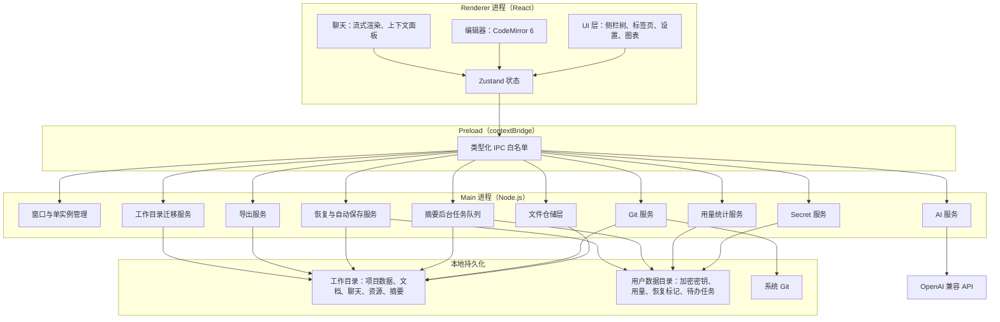

# 写作专精辅助 Agent 技术栈文档

版本：V1.1

对应需求文档：`writing-agent-prd-v1.3.md`

## 修订说明

V1.1 对照 opus5 的 `tech-stack-v1.0.md` 做了合并，保留本文档的选型对比、架构图和 PRD 覆盖检查，同时吸收 opus5 的四个已确认决策与实现细节：

- T-1 Git 安装采用三级降级链：winget、PortableGit、手动提示。
- T-2 摘要复用主模型配置，独立参数与 Prompt，用量单独打标。
- T-3 工作目录迁移采用物理复制，保留完整 `.git`。
- T-4 Token 统计采用按月分文件、按小时稀疏聚合、lifetime 独立累计。

文中涉及的技术选型统一以本文档为准，避免两份文档出现冲突。

## 1. 文档目的

本文档把 PRD V1.3 的产品规则转换为可实施的技术栈、架构边界和关键工程决策。目标读者是后续负责脚手架搭建、模块实现和评审的开发人员。

## 2. 需求驱动的技术约束

| 编号 | PRD 约束 | 技术含义 |
| --- | --- | --- |
| C1 | 首批仅 Windows，桌面端 | 需要 Windows 文件关联、单实例、本地进程与本地存储能力 |
| C2 | 项目主数据以文件形式存储，不用数据库 | 需要可靠的文件读写、目录索引、原子写入与 Git 可读文本格式 |
| C3 | 每个项目一个 Git 仓库，工作目录根目录不是 Git 仓库 | 需要按项目隔离 Git 操作与历史 |
| C4 | API Key 本地加密，不进项目目录和 Git | 需要 OS 级密钥保护，密钥与项目数据物理分离 |
| C5 | 单实例模式，第二实例转发文件路径 | 需要桌面框架单实例锁与跨实例传参能力 |
| C6 | `.md` 纯文本编辑，UTF-8，新建 LF，打开保留原换行符 | 编辑器不能按所见即所得处理，需要保留原始文本和行尾 |
| C7 | 编辑器右键菜单、选中文字、上下文范围高亮 | 编辑器需要可扩展的选区、装饰和右键菜单能力 |
| C8 | OpenAI 兼容 API，流式输出，可取消，读取 `usage` | 需要流式客户端、`AbortController` 和 `include_usage` |
| C9 | 文档摘要与聊天摘要后台生成，关闭窗口和退出时仍要处理 | 需要独立于窗口生命周期的后台任务队列与持久化 |
| C10 | 异常退出恢复、自动保存、原子写入 | 需要防抖保存、恢复标记与文件级事务 |
| C11 | Token 统计折线图 | 需要轻量图表库与本地聚合存储 |
| C12 | 项目导出 Zip，默认勾选文档和资源 | 需要流式 Zip 打包能力 |

## 3. 总体技术栈

推荐采用 **Electron 33+ + React 19 + TypeScript** 构建桌面端，使用 **electron-vite** 统一构建，使用 **CodeMirror 6** 作为编辑器内核，使用本地文件系统作为唯一主数据存储，使用系统 Git 作为版本管理后端。

| 层级 | 选择 | 说明 |
| --- | --- | --- |
| 桌面运行时 | Electron 33+ | 单实例锁、文件关联、`safeStorage`、原生对话框与窗口生命周期成熟 |
| 前端框架 | React 19 + TypeScript | 标签页、树、滑块、设置页等复杂交互适合组件化开发 |
| 构建工具 | electron-vite + Vite | 统一 main、preload、renderer 三端构建 |
| 编辑器 | CodeMirror 6 | 轻量、可装饰选区、可定制右键菜单和快捷键，不做 Markdown 渲染 |
| UI 组件 | Tailwind CSS 4 + shadcn/ui + lucide-react | Radix 原语按需组合，支持暗黑模式 |
| 状态管理 | Zustand 5 | 适合桌面端多标签、树节点、设置和会话的轻量全局状态 |
| 文件 I/O | `write-file-atomic` + `fs-extra` | 原子写入、递归复制和目录迁移 |
| AI 客户端 | `openai` 4.x | 支持 `baseURL`、流式、`stream_options.include_usage` 和取消 |
| Token 估算 | `tiktoken` WebAssembly 版 | 按模型映射 encoding，未知模型回退保守估算 |
| 图表 | Recharts | 两张折线图足够，React 集成简单 |
| 版本管理 | 系统 Git + `simple-git` | PRD 要求检测并安装系统 Git，使用 CLI 保持 Git 行为一致 |
| Zip 导出 | `archiver` | 流式压缩，适合导出文档和资源 |
| 加密存储 | Electron `safeStorage` | Windows 使用 DPAPI，密钥不进项目目录 |
| 后台任务 | `p-queue` 并发数 1 | 摘要生成串行队列，退出时等待或超时 |
| 测试 | Vitest + React Testing Library + Playwright Electron | 单元、组件和桌面端端到端覆盖 |
| 打包 | electron-builder + NSIS | Windows 安装包、文件关联和代码签名 |

## 4. 关键选型对比

### 4.1 桌面框架

| 维度 | Electron | Tauri 2 | WPF / WinUI 3 |
| --- | --- | --- | --- |
| Windows 单实例 | 原生 `requestSingleInstanceLock` | 支持 | Mutex 可做 |
| 文件关联 | electron-builder `fileAssociations` | 配置支持 | 注册表可做 |
| 本地加密 | `safeStorage` 走 DPAPI | 需 Rust keyring 封装 | `ProtectedData` 直接可用 |
| 编辑器生态 | CodeMirror/Monaco 直接可用 | WebView 同样可用 | 需自研或引入 AvalonEdit |
| 图表与 UI 生态 | 最丰富 | 同样丰富 | 较弱，需额外库 |
| 二进制体积 | 大 | 小 | 小 |
| 开发与维护成本 | 低 | 中，需 Rust 工具链 | 中，UI 定制成本高 |
| 未来跨平台 | 好 | 好 | 受限 |

**决策：Electron。** 本项目不是性能敏感型应用，二进制体积不是首要约束。核心诉求是编辑器和对话界面的开发效率、Windows 单实例与文件关联的成熟支持，以及 `safeStorage` 对 API Key 的 OS 级保护。

**备选：Tauri 2。** 如果后续把安装包体积和内存占用列为硬指标，可迁移到 Tauri 2。此时需新增 Rust 侧的 Git、密钥环、单实例和文件关联封装，UI 层大部分可复用。

### 4.2 编辑器内核

| 维度 | CodeMirror 6 | Monaco | 原生 RichEdit/AvalonEdit |
| --- | --- | --- | --- |
| 纯文本 Markdown 编辑 | 适合 | 适合但偏重 | 适合 |
| 选区高亮与装饰 | 强，支持 decorations | 强 | AvalonEdit 可用 |
| 自定义右键菜单 | 容易 | 容易 | 较繁琐 |
| 快捷键优先级控制 | 容易 | 容易 | 较繁琐 |
| 包体积与复杂度 | 较低 | 较高 | 取决于框架 |

**决策：CodeMirror 6。** PRD 明确不要复杂排版、不渲染 Markdown，只需要行号或段落编号、纯文本编辑、选区高亮和右键菜单。CodeMirror 6 的功能密度和定制成本最匹配。

### 4.3 Git 接入方式

| 方案 | 优点 | 缺点 |
| --- | --- | --- |
| 系统 Git + `simple-git` | 保留标准 Git 行为，符合 PRD 的检测与安装要求 | 依赖系统 Git |
| `isomorphic-git` | 纯 JS，无系统依赖 | 功能覆盖不如原生 Git，且与 PRD 的检测安装流程冲突 |
| `nodegit` | 功能强 | 原生模块编译复杂，维护成本高 |

**决策：系统 Git + `simple-git`。** PRD 第 2.7 条明确要求检测 Git、提示安装、同意后自动安装。因此把系统 Git 作为唯一后端，`simple-git` 只做进程调用与结果解析。

## 5. 系统架构



### 5.1 进程边界

- **Main 进程**：文件系统、Git、AI 请求、加密、摘要任务队列、单实例、文件关联、恢复标记、用量统计和工作目录迁移。
- **Renderer 进程**：UI 展示、编辑器、上下文面板、图表和交互状态。Renderer 不直接访问文件系统或网络。
- **Preload**：通过 `contextBridge` 暴露白名单化的类型化 IPC 方法，不暴露 Node.js API。

安全配置：

- `contextIsolation: true`
- `nodeIntegration: false`
- `sandbox: true`
- 关闭 remote 模块
- 设置内容安全策略
- IPC 通道全部采用枚举和 TypeScript 类型约束

## 6. 技术选型清单

### 6.1 运行时与打包

| 职责 | 选型 | 说明 |
| --- | --- | --- |
| 桌面运行时 | Electron 33+ | Windows 首批支持，单实例 API、safeStorage、原生文件对话框成熟 |
| 构建工具 | electron-vite | 开箱即用的 Vite + Electron 集成，HMR 友好 |
| 打包发布 | electron-builder | Windows NSIS 安装包，支持代码签名 |
| 语言 | TypeScript 5 | 主进程、预加载脚本、渲染进程统一 TS |

### 6.2 UI 框架与组件

| 职责 | 选型 | 说明 |
| --- | --- | --- |
| UI 框架 | React 19 | 组件化，生态成熟 |
| 样式 | Tailwind CSS 4 | 工具类优先，暗黑模式内置 |
| 组件库 | shadcn/ui | 基于 Radix UI 的无样式原语，按需引入 |
| 图标 | lucide-react | 统一使用 lucide |
| 状态管理 | Zustand 5 | 轻量，避免 Redux 样板代码 |

### 6.3 编辑器

| 职责 | 选型 | 说明 |
| --- | --- | --- |
| 编辑器核心 | CodeMirror 6 | 纯文本编辑，不渲染 Markdown；支持行号、字体调节、暗黑主题和自定义右键菜单 |
| 换行符处理 | CodeMirror + 主进程 `fs` | 打开已有文档保留原换行符，新建文档强制 LF |
| 未保存标记 | `EditorView.updateListener` | 监听内容变更，渲染脏状态标记 |
| 基础语法着色 | `@codemirror/lang-markdown` | 可选，仅做着色，不做渲染 |
| 快捷键优先级 | CodeMirror keymap | 复制、粘贴、剪切、撤销、保存保持最高优先级，AI 功能快捷键不覆盖 |

### 6.4 文件 I/O 与原子写入

| 职责 | 选型 | 说明 |
| --- | --- | --- |
| 原子写入 | `write-file-atomic` | 写临时文件后 rename，避免进程中断留下半写文件 |
| 目录操作 | `fs/promises` + `fs-extra` | 递归创建、复制、迁移目录 |
| 文件编码 | UTF-8 | `readFile`、`writeFile` 显式指定编码 |

### 6.5 版本管理

| 职责 | 选型 | 说明 |
| --- | --- | --- |
| Git 操作封装 | `simple-git` | 支持 init/add/commit/log/checkout，通过 `customBinary` 指定路径 |
| 仓库粒度 | 每个项目一个 Git 仓库 | PRD 2.3 |
| 二进制路径持久化 | `app-config.json` 的 `git.binaryPath` | 解析结果写入配置，启动时复用 |

**Git 安装三级降级链（T-1，PRD 2.7）**

| 级别 | 策略 | 触发条件 | 权限要求 |
| --- | --- | --- | --- |
| L1 | `winget install Git.Git --silent` | winget 可用 | 可能触发 UAC |
| L2 | 下载 PortableGit 自解压包到 `userData/portable-git/` | winget 不存在或 L1 失败 | 无需管理员 |
| L3 | 提示用户手动安装，开关保持关闭 | L1、L2 均失败 | 无 |

L2 是无 winget 旧 Windows 的主力兜底路径：PortableGit 自解压包用 `-o<dir> -y` 静默解压到用户目录，不写注册表、不需要管理员权限。下载后校验 SHA256，失败则降级到 L3。

Git 二进制解析顺序：`app-config.json` 记录路径、系统 PATH、`userData/portable-git/cmd/git.exe`。

### 6.6 API 集成

| 职责 | 选型 | 说明 |
| --- | --- | --- |
| AI 请求 | `openai` 4.x | 支持 OpenAI 兼容协议、流式输出、`include_usage`、自定义 `baseURL` |
| 取消生成 | `AbortController` + stream abort | PRD 6.5、9.26 |
| 流式 usage | `stream_options: { include_usage: true }` | PRD 8.5、9.28 |
| 请求执行位置 | Main 进程 | API Key 不暴露到 Renderer，Renderer 通过 IPC 订阅流式 chunk |

### 6.7 API Key 加密

| 职责 | 选型 | 说明 |
| --- | --- | --- |
| 加密存储 | Electron `safeStorage` | Windows DPAPI 加密，写入 userData 独立文件，不进入项目 Git |
| 界面显示 | 密文显示，只返回“是否已配置” | API Key 明文不传给 Renderer |

### 6.8 Tokenizer

| 职责 | 选型 | 说明 |
| --- | --- | --- |
| Token 估算 | `tiktoken` WebAssembly 版 | 在 Main 进程运行，按模型名选择 encoding；未知模型回退保守估算 |

### 6.9 用量图表

| 职责 | 选型 | 说明 |
| --- | --- | --- |
| 折线图 | Recharts | 近 30 天趋势图、当日每小时趋势图 |

### 6.10 ZIP 导出

| 职责 | 选型 | 说明 |
| --- | --- | --- |
| 打包压缩 | `archiver` | 流式 ZIP 生成，支持按用户勾选条件增减目录 |

导出选项按 PRD 5.3 实现：写作文档和资源文件默认勾选，聊天记录、归档区、摘要数据和 Git 历史默认不勾选；用户可在导出前调整。

### 6.11 防抖与自动保存

| 职责 | 选型 | 说明 |
| --- | --- | --- |
| 防抖 | `lodash.debounce` | 编辑器停止输入后按设置间隔，默认 5 秒触发保存 |

### 6.12 摘要生成

| 职责 | 选型 | 说明 |
| --- | --- | --- |
| 异步任务队列 | `p-queue`，并发数 1 | 主进程维护摘要 FIFO 队列；before-quit 等待，超时强制退出 |
| 模型配置 | 复用主模型配置 | PRD 8.2 当前版本只支持一个模型 |
| 请求参数 | 独立低温度 + 独立 Prompt | `temperature: 0.3`、收紧 `max_tokens`、非流式 |
| 用量归属 | 打标 `source: 'summary'` | 与 `source: 'chat'` 区分 |
| 取消隔离 | 摘要请求不受用户取消影响 | 用户取消只中断 chat 流 |

后续若开放多模型，只需在 `app-config.json` 增加 `summary.modelOverride` 字段，服务层读取时优先使用该字段。

文档摘要触发条件为 PRD 7.2 的两个 OR 条件：

- `增删改字符总量 / max(上次快照长度, 1) > 30%`
- `文档净增加字数 > 500`

聊天摘要则在摘要功能开启且对话至少发生一次用户与 AI 交换后，于关闭对话窗口时在后台生成或更新；新消息才触发更新。

### 6.13 单实例模式

| 职责 | 选型 | 说明 |
| --- | --- | --- |
| 单实例锁 | `app.requestSingleInstanceLock()` | 第二实例退出，第一实例监听 `second-instance` 接收路径 |

## 7. 目录结构

### 7.1 源码结构

```text
src/
  main/
    index.ts
    ipc/
    services/
      file.service.ts
      git.service.ts
      api.service.ts
      crypto.service.ts
      summary.service.ts
      usage.service.ts
      export.service.ts
      recovery.service.ts
      migration.service.ts
    install/
      git-installer.ts
      git-resolver.ts
  preload/
    index.ts
  renderer/
    components/
      editor/
      chat/
      sidebar/
      settings/
      usage/
    store/
    hooks/
    pages/
```

### 7.2 工作目录结构

```text
<工作目录>/
  app-index.json
  trash/
  <project-id>/
    .git/
    meta.json
    docs/
      <doc-id>.md
    chats/
      <chat-id>.jsonl
      <chat-id>.meta.json
    summaries/
      docs/<doc-id>.json
      chats/<chat-id>.json
    resources/
      <file-id>/
        meta.json
        content
    archives/
      <chat-id>.jsonl
      <chat-id>.meta.json
    trash/
      docs/<doc-id>.md
```

```text
<userData>/
  api-key.enc
  app-config.json
  portable-git/
  usage/
    <YYYY-MM>.json
    lifetime.json
  recovery.json
```

说明：

- 工作目录根目录只保存 `app-index.json`、项目级回收站元数据和各项目目录，不作为一个统一 Git 仓库。
- 对话采用 JSONL 保存事件流，每行一个事件，便于增量追加和 Git 按行 diff；元数据单独存放，避免把状态混入正文。
- 资源上传后以 `resources/<file-id>/meta.json` 和 `content` 保存快照，历史会话引用该快照，不随原始文件后续修改而变化。
- `api-key.enc`、`app-config.json`、`portable-git/`、`usage/` 和 `recovery.json` 都位于 Electron `userData`，不进入项目 Git。

### 7.3 Token 统计数据结构（T-4）

`usage/<YYYY-MM>.json`：

```json
{
  "month": "2026-08",
  "days": {
    "2026-08-13": {
      "total": { "prompt": 128400, "completion": 31200, "total": 159600 },
      "hours": {
        "09": { "prompt": 24100, "completion": 5300, "total": 29400, "calls": 7 },
        "14": { "prompt": 61200, "completion": 18900, "total": 80100, "calls": 12 }
      },
      "bySource": {
        "chat": { "total": 141200 },
        "summary": { "total": 18400 }
      },
      "uncounted": 2
    }
  }
}
```

`usage/lifetime.json`：

```json
{ "prompt": 8412000, "completion": 2103400, "total": 10515400, "uncounted": 37 }
```

设计要点：

- 按月分文件，单文件体积可控；近 30 天查询最多读 2 个文件。
- `hours` 使用稀疏键，只写有调用的小时，空闲小时在渲染层补 0。
- `lifetime.json` 独立累计，避免扫描全部月份。
- `uncounted` 单独计数，用于响应缺少 `usage` 时的排查。
- 写入使用原子写，主进程串行执行读改写。

## 8. 关键模块实现方案

### 8.1 单实例与文件关联

```typescript
const ALLOWED_EXT = ['.txt', '.md', '.csv'];
const lock = app.requestSingleInstanceLock();
if (!lock) {
  app.quit();
} else {
app.on('second-instance', (_event, argv) => {
    const filePath = argv.find(a => ALLOWED_EXT.some(ext => a.endsWith(ext)));
    if (filePath) {
      mainWindow.webContents.send('open-external-file', filePath);
    }
    mainWindow.show();
    mainWindow.flashFrame(true);
  });
}
```

Renderer 收到路径后按 PRD 1.5 处理：`.txt`、`.md`、`.csv` 打开；不属于任何项目时自动创建项目并作为资源文件打开；其他文件拒绝并提示用户。

### 8.2 原子写入

```typescript
import writeFileAtomic from 'write-file-atomic';

export async function saveDocument(path: string, content: string): Promise<void> {
  await writeFileAtomic(path, content, { encoding: 'utf8' });
}
```

新建文档时写入前统一转换换行符为 LF。

### 8.3 流式 API 请求与取消

```typescript
import OpenAI from 'openai';

export async function streamChat(
  params: ChatParams,
  onChunk: (chunk: ChatCompletionChunk) => void,
  signal: AbortSignal
): Promise<void> {
  const client = new OpenAI({ baseURL, apiKey });
  const stream = client.chat.completions.stream({
    ...params,
    stream_options: { include_usage: true },
  });

  stream.on('chunk', onChunk);
  signal.addEventListener('abort', () => stream.abort());

  try {
    const completion = await stream.finalChatCompletion();
    if (completion.usage) recordUsage(completion.usage, 'chat');
  } catch (err) {
    if (signal.aborted) return;
    throw err;
  }
}
```

取消后只保留用户消息，不把已生成的 AI 部分写入对话。AI 输出只通过 `stream:chunk` 返回，不提供写回编辑器的 IPC，也不提供一键应用、自动写入或自动插入通道。

### 8.4 API Key 加密

```typescript
import { safeStorage } from 'electron';
import { readFile } from 'fs/promises';

export async function saveApiKey(key: string): Promise<void> {
  const encrypted = safeStorage.encryptString(key);
  await writeFileAtomic(API_KEY_PATH, encrypted);
}

export async function loadApiKey(): Promise<string> {
  const encrypted = await readFile(API_KEY_PATH);
  return safeStorage.decryptString(encrypted);
}
```

### 8.5 摘要生成

```typescript
import PQueue from 'p-queue';

const queue = new PQueue({ concurrency: 1 });

async function generateSummary(chatId: string): Promise<void> {
  const cfg = await loadApiConfig();
  const client = new OpenAI({ baseURL: cfg.baseURL, apiKey: cfg.apiKey });
  const res = await client.chat.completions.create({
    model: cfg.summary.modelOverride ?? cfg.model,
    messages: buildSummaryPrompt(chatId),
    temperature: 0.3,
    max_tokens: 512,
  });
  if (res.usage) recordUsage(res.usage, 'summary');
  await saveSummaryAtomic(chatId, res.choices[0].message.content);
}

export function enqueueSummary(chatId: string) {
  queue.add(() => generateSummary(chatId).catch(() => markRetry(chatId)));
}
```

应用退出时等待摘要队列，超时则强制退出并写入错误标记，下次启动提示重试。

### 8.6 上下文范围与 Token 预算

右键调用“诊断”“走向”或“优化”时创建新的文档级上下文对话，并按以下规则初始化范围：

- 诊断、优化：以光标或选区为中心，默认前后各 200 字；有选区时选区为核心。
- 走向：前文默认 500 字，后文有内容时默认 200 字，否则 0 字；有选区时按选区起点和终点切分前后文。
- 前文、后文通过滑块和精确数字输入框调整，CodeMirror 用装饰高亮对应范围。
- 光标或选区在文档开头时前文为 0 且前文滑块禁用；在结尾时后文为 0 且后文滑块禁用。
- AI 输出期间滑块不可调整；输出结束后可再次调整，系统提示是否重新生成最近一条 AI 回答，确认后替换该回答并保留用户输入。
- 空文档或无本文档上下文时，使用当前项目内其他文档摘要和对话摘要；仍无摘要则询问用户想写什么，不编造正文。

Token 预算优先级从高到低：

1. 用户当前选区或核心内容。
2. 选区附近的上下文。
3. 当前对话历史。
4. 其他文档摘要和聊天摘要。

Main 进程在发起请求前用 `tiktoken` 计算各部分 token，从低优先级向上截断，确保总量不超过用户配置上限，默认 256k token。

### 8.7 异常退出恢复

- 启动时写入 `userData/recovery.json`，记录最后打开的项目 ID、文档 ID 和时间戳。
- 正常关闭时清除该文件。
- 下次启动检测到文件时提示是否恢复上次打开的内容。

### 8.8 Git 三级降级安装

```typescript
export async function ensureGit(): Promise<GitResult> {
  const existing = await resolveGitBinary();
  if (existing) return { ok: true, path: existing };

  if (!await userConsentsToInstall()) {
    return { ok: false, reason: 'declined' };
  }

  if (await hasWinget()) {
    try {
      await execFileAsync('winget', [
        'install', 'Git.Git', '--silent',
        '--accept-package-agreements', '--accept-source-agreements',
      ], { timeout: 300_000 });
      const p = await resolveGitBinary();
      if (p) return { ok: true, path: p };
    } catch { /* L2 */ }
  }

  try {
    const archive = await downloadPortableGit();
    const dest = join(app.getPath('userData'), 'portable-git');
    await execFileAsync(archive, [`-o${dest}`, '-y']);
    const p = join(dest, 'cmd', 'git.exe');
    if (await pathExists(p)) {
      await saveConfig({ git: { binaryPath: p } });
      return { ok: true, path: p };
    }
  } catch { /* L3 */ }

  return { ok: false, reason: 'manual-required' };
}
```

所有 `simple-git` 实例统一注入解析出的路径：

```typescript
simpleGit(projectPath).customBinary(await resolveGitBinary());
```

### 8.9 工作目录迁移

采用物理复制而非逐仓库 clone：

1. 校验目标可写、不是自身子目录、无冲突、空间充足。
2. 版本管理开启时先提交所有存在变更的项目。
3. 逐项目复制到目标暂存目录，包含完整 `.git`。
4. 校验文件数与字节数一致。
5. 原子生效并更新配置指向新目录。
6. 失败时删除暂存目录，原目录保持可用，旧目录由用户手动清理。

选择物理复制的理由：`.git` 整体复制即可保留完整历史、reflog、分支与仓库级配置；失败语义简单，原工作目录始终不被修改。

### 8.10 Token 统计写入

```typescript
type UsageSource = 'chat' | 'summary';

export async function recordUsage(
  usage: CompletionUsage | undefined,
  source: UsageSource
): Promise<void> {
  const now = new Date();
  const file = usagePath(format(now, 'yyyy-MM'));

  if (!usage) {
    await mutate(file, d => { dayOf(d, now).uncounted += 1; });
    return;
  }

  await mutate(file, d => {
    const day = dayOf(d, now);
    const hour = hourOf(day, now);
    for (const bucket of [day.total, hour]) {
      bucket.prompt += usage.prompt_tokens;
      bucket.completion += usage.completion_tokens;
      bucket.total += usage.total_tokens;
    }
    hour.calls += 1;
    day.bySource[source].total += usage.total_tokens;
  });

  await mutateLifetime(usage);
}
```

`mutate` 内部通过串行队列执行读改写并原子落盘。

## 9. 数据生命周期与软删除状态

生命周期状态存储在对象所属的元数据 JSON 中，不依赖文件名或目录移动：

- 文档：`normal`、`trash`、`purged`。
- 对话：`normal`、`user_archived`、`orphan_archived`、`purged`。
- 项目：`normal`、`trash`、`purged`。

删除和恢复只更新元数据状态与关联关系。彻底删除时再物理删除文件，并按 PRD 第 4 章处理孤儿对话、摘要和资源。

## 10. IPC 接口一览

所有 IPC channel 通过 `contextBridge` 在 `preload/index.ts` 统一暴露，Renderer 不直接访问 Node.js API。

| Channel | 方向 | 说明 |
| --- | --- | --- |
| `file:readDoc` | 渲染到主 | 读取写作文档内容 |
| `file:saveDoc` | 渲染到主 | 原子写入文档 |
| `file:listProjects` | 渲染到主 | 返回项目索引 |
| `api:streamChat` | 渲染到主 | 发起流式请求 |
| `api:cancelStream` | 渲染到主 | 取消当前生成 |
| `git:ensure` | 渲染到主 | 触发 Git 三级降级安装 |
| `git:commit` | 渲染到主 | 执行自动提交 |
| `git:log` | 渲染到主 | 获取提交历史 |
| `git:rollback` | 渲染到主 | 执行回滚 |
| `workspace:migrate` | 渲染到主 | 触发工作目录迁移 |
| `crypto:setApiKey` | 渲染到主 | 加密保存 API Key |
| `crypto:hasApiKey` | 渲染到主 | 检查是否已配置，不返回明文 |
| `summary:getDoc` | 渲染到主 | 读取文档摘要 |
| `usage:get` | 渲染到主 | 获取 Token 统计数据 |
| `open-external-file` | 主到渲染 | 单实例模式传入外部文件路径 |
| `stream:chunk` | 主到渲染 | 推送流式 AI 内容 chunk |
| `stream:done` | 主到渲染 | 流式完成通知，含 usage |
| `migrate:progress` | 主到渲染 | 迁移进度推送 |
| `git:install-progress` | 主到渲染 | Git 安装或下载进度推送 |

## 11. 构建与依赖清单

```json
{
  "dependencies": {
    "electron": "^33.0.0",
    "react": "^19.0.0",
    "react-dom": "^19.0.0",
    "zustand": "^5.0.0",
    "@codemirror/view": "^6.0.0",
    "@codemirror/state": "^6.0.0",
    "@codemirror/commands": "^6.0.0",
    "@codemirror/language": "^6.0.0",
    "@codemirror/search": "^6.0.0",
    "@codemirror/lang-markdown": "^6.0.0",
    "openai": "^4.0.0",
    "simple-git": "^3.0.0",
    "write-file-atomic": "^6.0.0",
    "fs-extra": "^11.0.0",
    "tiktoken": "^1.0.0",
    "archiver": "^7.0.0",
    "p-queue": "^8.0.0",
    "recharts": "^2.0.0",
    "date-fns": "^4.0.0",
    "lodash.debounce": "^4.0.0",
    "tailwindcss": "^4.0.0",
    "lucide-react": "latest"
  },
  "devDependencies": {
    "electron-vite": "^2.0.0",
    "electron-builder": "^25.0.0",
    "typescript": "^5.0.0",
    "vite": "^6.0.0",
    "vitest": "^3.0.0",
    "@testing-library/react": "^16.0.0",
    "playwright": "^1.0.0"
  }
}
```

## 12. 安全约束

| 约束 | 实现 |
| --- | --- |
| `nodeIntegration` 关闭 | `webPreferences: { nodeIntegration: false, contextIsolation: true }` |
| API Key 不进 Git | safeStorage 加密文件位于 userData，不在项目目录 |
| 渲染进程不接触明文 Key | 主进程持有，渲染进程只调用“是否已配置”接口 |
| 资源文件快照隔离 | 快照写入资源目录，与原始文件解耦 |
| 新建文档换行符 | 强制 LF，UTF-8 编码 |
| PortableGit 下载校验 | 固定官方地址 + SHA256 校验，失败降级到 L3 |
| 迁移零破坏 | 复制到暂存目录并校验后才生效，原工作目录在成功前不被修改 |

## 13. 测试策略

| 层级 | 工具 | 覆盖重点 |
| --- | --- | --- |
| 单元测试 | Vitest | 文件仓储、生命周期状态机、上下文范围计算、Token 预算、摘要触发条件、原子写入 |
| 组件测试 | React Testing Library | 上下文面板边界状态、标签页脏标记、设置页开关、导出选项 |
| 桌面端到端 | Playwright Electron | 单实例文件传递、软删除恢复、Git 自动提交、取消生成、异常退出恢复、流式 usage |

核心验收标准直接映射到 E2E 场景，重点覆盖数据生命周期、Git 隔离、上下文边界和异常恢复，避免只测 UI 外观。

## 14. 已确认决策

| 编号 | 决策 | 理由 |
| --- | --- | --- |
| T-1 | Git 安装三级降级：winget、PortableGit、手动提示 | PortableGit 自解压不需管理员权限、不写注册表，覆盖无 winget 的旧 Windows |
| T-2 | 摘要复用主模型配置，独立参数与 Prompt，用量打标 `source: 'summary'` | PRD 8.2 当前版本单模型；预留 `summary.modelOverride` 扩展点 |
| T-3 | 工作目录迁移采用物理复制，暂存校验后生效 | 整体复制 `.git` 保留完整历史；失败只需删暂存目录，原目录始终完好 |
| T-4 | Token 统计按月分文件、按小时稀疏聚合、lifetime 独立累计 | 近 30 天最多读 2 个文件；历史总消耗无需扫描全部月份 |

## 15. 遗留风险

| 风险 | 影响 | 缓解 |
| --- | --- | --- |
| PortableGit 下载地址随版本变更 | L2 降级失效 | 版本号纳入应用配置，下载失败即降级 L3 |
| winget 安装可能弹出 UAC | 用户感知为非静默 | 安装前提示将出现系统弹窗 |
| 大工作目录迁移耗时长 | 迁移期间不可用 | 进度推送并禁用编辑，提前告知不可中途取消 |
| 摘要与对话共用配额 | 用量图表混合两类消耗 | `bySource` 字段已分离，图表可按来源拆分 |
| Electron 安装包较大 | 分发成本较高 | 接受当前约束，必要时评估 Tauri 2 |

## 16. 与 PRD 的覆盖检查

| PRD 主题 | 技术文档位置 |
| --- | --- |
| 产品边界与不自动写入 | 5.1 进程边界、8.3 流式 API |
| 单实例与文件关联 | 6.13、8.1 |
| 文件存储与原子写入 | 6.4、7.2、8.2 |
| Git 仓库粒度与跟踪范围 | 6.5、7.2 |
| 数据生命周期 | 9 |
| 编辑器与保存行为 | 6.3、6.11、8.2 |
| 聊天、流式、取消、usage | 6.6、8.3、8.10 |
| 右键菜单与上下文控制面板 | 6.3、8.6 |
| 上下文范围与 Token 预算 | 6.8、8.6 |
| 摘要系统 | 6.12、8.5 |
| 设置、API、用量、版本管理 | 6.5、6.6、6.7、8.8、8.10 |
| 资源上传与快照 | 7.2 |
| Token 统计图表 | 6.9、7.3、8.10 |
| 导出与导出选项 | 6.10 |
| 异常退出恢复 | 8.7 |
| 工作目录迁移 | 8.9 |
